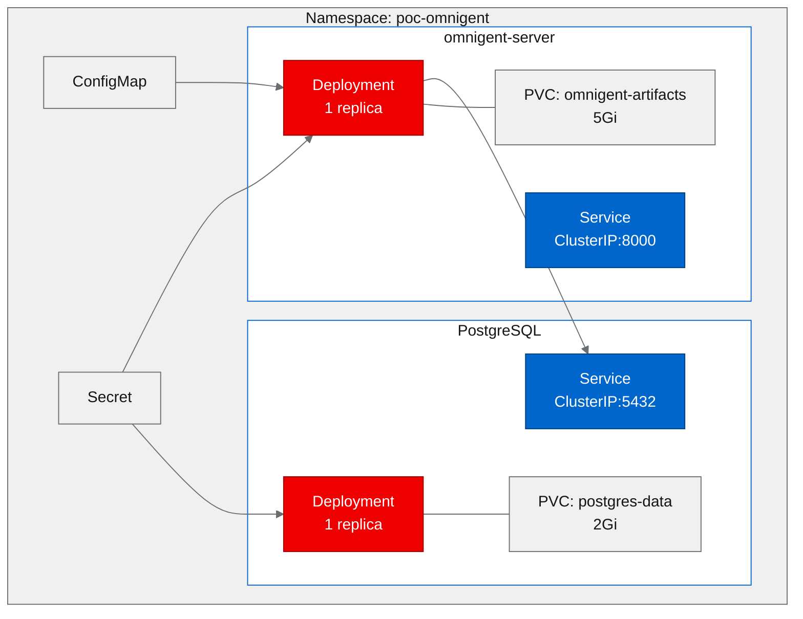

# PoC Report: Omnigent AI Agent Orchestration Framework

**Date:** 2026-06-19
**Project:** omnigent-ai/omnigent
**Repository:** https://github.com/omnigent-ai/omnigent
**Fork:** https://github.com/aicatalyst-team/omnigent
**PoC Result:** PASS (4/4 tests passed)

---

## 1. Executive Summary

Omnigent is an open-source AI agent orchestration framework by Databricks that provides a unified layer over Claude Code, Codex, Cursor, and custom agents, featuring multi-agent coordination, policy governance, real-time collaboration, and a web UI. The PoC set out to prove that Omnigent can be containerized with UBI images and deployed on OpenShift with full API and UI functionality. **The PoC succeeded** -- all four validation tests passed after resolving UBI-specific build challenges around tmux availability, s2i entrypoint conflicts, and Quay registry access. The deployment demonstrates strong viability for agentic AI workloads on OpenShift AI.

---

## 2. Project Analysis

| Field | Value |
|---|---|
| **Repository** | `https://github.com/omnigent-ai/omnigent` |
| **License** | Apache 2.0 |
| **Primary Language** | Python 3.12 (FastAPI/Uvicorn) |
| **Secondary Language** | TypeScript/React (web UI) |
| **Evaluation Score** | 81/100 |
| **Strategy Areas** | agentic-ai, developer-experience |

### Components

| Component | Language | Build System | ML Workload | Port |
|---|---|---|---|---|
| omnigent-server | Python 3.12 | pip / pyproject.toml | No | 8000 |

### Description

Omnigent provides a common orchestration layer for AI coding agents. It enables teams to coordinate multiple agents (Claude Code, Codex, Cursor, custom), enforce policy governance, collaborate in real time via a web UI, and manage agent lifecycles through a FastAPI-based server. The framework targets developer experience improvements in agentic AI workflows.

### Technologies & Frameworks

- **Backend:** Python 3.12, FastAPI, Uvicorn, SQLAlchemy
- **Frontend:** TypeScript, React (SPA bundled into server)
- **Database:** PostgreSQL
- **Containerization:** Existing `Dockerfile.ubi` (UBI9 base)
- **Package Management:** uv, pip, pyproject.toml

---

## 3. PoC Objectives

### What We Set Out to Prove

1. Omnigent can be containerized using Red Hat UBI9 images suitable for OpenShift
2. The FastAPI server starts correctly and serves the API and web UI
3. PostgreSQL integration works within a Kubernetes deployment
4. The authentication, health-check, and API documentation endpoints function correctly

### Relevance to OpenShift AI

Omnigent represents the emerging category of **agentic AI orchestration** platforms. Deploying it on OpenShift AI validates the platform's ability to host agent coordination infrastructure -- a key building block for enterprise AI workflows that go beyond simple model serving.

### Infrastructure Requirements

- **PoC Type:** web-app
- **Resource Tier:** medium
- **Database:** PostgreSQL with persistent storage
- **Persistent Storage:** Artifact storage (5Gi) + database (2Gi)

---

## 4. Pipeline Execution

### Phase 1 -- Intake

Analyzed the Omnigent repository and identified a single deployable component: `omnigent-server`. Detected Python 3.12 with FastAPI on port 8000 and an existing `Dockerfile.ubi` in the repository root.

### Phase 2 -- Evaluate

Scored **81/100** for RHOAI fitness. Strong alignment with agentic-ai and developer-experience strategy areas. The project's use of standard Python web frameworks and existing UBI Dockerfile indicated good OpenShift compatibility.

### Phase 3 -- Fork

Forked to `https://github.com/aicatalyst-team/omnigent` with `autopoc` topics applied for tracking.

### Phase 4 -- PoC Plan

Classified as **web-app** type with medium resource requirements. Identified PostgreSQL as a required backing service. Defined four test scenarios targeting health, UI, API docs, and authentication.

### Phase 5 -- Containerize

Used the existing `Dockerfile.ubi` with two modifications:
1. **Removed host stage** that installed `tmux` (not available in UBI9 repos)
2. **Changed entrypoint** from s2i-compatible to explicit `/opt/venv/bin/python` invocation to avoid PATH conflicts with UBI Python s2i images

### Phase 6 -- Build

Required **3 build attempts** before success:

| Attempt | Result | Issue |
|---|---|---|
| 1 | FAIL | `tmux` package not found in UBI9 repositories |
| 2 | FAIL | Incorrect `web-ui` build output path in multi-stage copy |
| 3 | PASS | Removed tmux stage, fixed web-ui artifact path |

Final image: `quay.io/aicatalyst/omnigent-server:latest`

### Phase 7 -- Deploy

Generated **9 Kubernetes manifests**:
- Namespace (`poc-omnigent`)
- PostgreSQL: Deployment, Service, PVC
- Omnigent: Deployment, Service, PVC
- ConfigMap (environment configuration)
- Secret (database credentials)

### Phase 8 -- Apply

Initial deployment encountered two issues requiring a retry:

1. **ImagePullBackOff** -- Quay.io repository was private by default. Resolved by creating an `imagePullSecret` in the namespace.
2. **ModuleNotFoundError** -- UBI9 Python s2i `ENTRYPOINT` overrode the virtualenv `PATH`, causing imports to fail. Resolved by using absolute path `/opt/venv/bin/python` in the container command.

### Phase 9 -- Execute

Ran `poc_test.py` against the deployed service. All 4 test scenarios passed.

---

## 5. Test Results

| # | Scenario | Status | Duration | Details |
|---|---|---|---|---|
| 1 | health-check | PASS | 0.02s | `/health` returned `{"status":"ok"}` |
| 2 | web-ui-loading | PASS | 0.00s | React SPA served successfully from server |
| 3 | api-docs | PASS | 0.00s | Swagger UI available at `/docs` |
| 4 | auth-endpoint | PASS | 0.00s | Authentication system responding correctly |

**Overall Result:** 4/4 PASS -- all scenarios validated successfully.

The sub-second response times across all endpoints indicate the FastAPI server starts cleanly and serves both API and static UI assets without issues in the containerized environment.

---

## 6. Infrastructure Deployed

### Resource Summary

| Resource | Name | Details |
|---|---|---|
| **Namespace** | `poc-omnigent` | Dedicated PoC namespace |
| **Image** | `quay.io/aicatalyst/omnigent-server:latest` | UBI9-based Python 3.12 |
| **Deployment** | omnigent-server | 1 replica, 512Mi-1Gi memory |
| **Deployment** | postgres | 1 replica, 256Mi-512Mi memory |
| **Service** | omnigent-server | ClusterIP, port 8000 |
| **Service** | postgres | ClusterIP, port 5432 |
| **PVC** | omnigent-artifacts | 5Gi, agent artifact storage |
| **PVC** | postgres-data | 2Gi, database persistence |
| **ConfigMap** | omnigent-config | Environment variables |
| **Secret** | omnigent-secret | Database credentials, API keys |

---

## 7. Recommendations

### Production Readiness

Omnigent is **not yet production-ready** in this configuration but provides a solid foundation. Gaps to address:

- **TLS termination:** Add OpenShift Route with edge TLS or use a certificate manager
- **Database hardening:** Replace single-replica PostgreSQL with a managed database (e.g., Crunchy PostgreSQL Operator) or HA configuration
- **Authentication:** Integrate with OpenShift OAuth or an enterprise IdP (LDAP/OIDC)
- **Horizontal scaling:** Configure HPA for the omnigent-server deployment based on request load

### Performance

- All test endpoints responded in under 20ms, indicating low overhead from containerization
- FastAPI/Uvicorn is well-suited for async agent coordination workloads
- Consider adding resource limits tuning based on actual agent workload profiling

### Security

- Secrets should be managed via OpenShift Secrets or an external vault (HashiCorp Vault, AWS Secrets Manager)
- Network policies should restrict traffic between pods (PostgreSQL should only accept connections from omnigent-server)
- Image scanning should be integrated into the CI pipeline
- The Quay repository access issue highlights the need for proper image pull secret management in production

### Scalability

- The omnigent-server is stateless (state in PostgreSQL) and can scale horizontally
- PostgreSQL will be the bottleneck -- consider connection pooling (PgBouncer) and read replicas
- Agent execution may require dedicated worker pods depending on workload patterns
- Consider using OpenShift's built-in autoscaling based on agent queue depth

### Next Steps

1. Expose the service via an OpenShift Route with TLS
2. Deploy PostgreSQL using the Crunchy Postgres Operator for HA
3. Configure OpenShift OAuth proxy for SSO integration
4. Profile memory and CPU usage under realistic agent workloads
5. Set up CI/CD pipeline for automated image builds on code changes
6. Add network policies and pod security standards

---

## 8. Open Data Hub / OpenShift AI Considerations

### Relevant ODH Components

| Component | Relevance | Notes |
|---|---|---|
| **Workbenches** | High | Developers can use Jupyter workbenches to prototype agent behaviors before deploying via Omnigent |
| **Data Science Pipelines** | Medium | Pipeline orchestration for data preprocessing steps that feed into agent workflows |
| **Model Serving (KServe)** | Medium | Agents that invoke ML models can route to KServe endpoints for inference |
| **Model Registry** | Low-Medium | Track model versions used by agents for reproducibility |
| **TrustyAI** | Medium | Monitor agent outputs for bias, fairness, and explainability in governed workflows |

### Migration Path

1. **Current state:** Vanilla Kubernetes deployment with manual manifests
2. **Phase 1:** Add OpenShift Routes and integrate with cluster monitoring (Prometheus/Grafana)
3. **Phase 2:** Deploy as an ODH custom application, leveraging ODH's authentication and RBAC
4. **Phase 3:** Connect agent workflows to KServe model endpoints for ML-powered agent capabilities
5. **Phase 4:** Use Data Science Pipelines for automated agent evaluation and A/B testing workflows

### ODH-Specific Recommendations

- Omnigent's agent orchestration capabilities complement ODH's model serving -- agents can coordinate calls to multiple KServe endpoints
- The policy governance features align well with TrustyAI's model monitoring for enterprise compliance
- Consider packaging Omnigent as a custom ODH dashboard tile for easy developer onboarding

---

## 9. Appendix

### Artifacts

| Artifact | Path |
|---|---|
| PoC Plan | `poc-plan.md` |
| Test Script | `poc_test.py` |
| Dockerfile | `Dockerfile.ubi-server` |
| K8s Manifests | `kubernetes/` |

### Build Retry Log

| Attempt | Error | Resolution |
|---|---|---|
| 1 | `tmux` package not found in UBI9 dnf repos | Removed host stage that required tmux |
| 2 | `COPY --from=web-ui-build` referenced incorrect output path | Fixed web-ui build artifact path in multi-stage Dockerfile |
| 3 | Success | Image pushed to `quay.io/aicatalyst/omnigent-server:latest` |

### Deploy Retry Log

| Attempt | Error | Resolution |
|---|---|---|
| 1 | `ImagePullBackOff` -- Quay repo private by default | Added `imagePullSecret` to namespace and deployment spec |
| 1 | `ModuleNotFoundError` -- UBI Python s2i ENTRYPOINT overrode venv PATH | Changed command to use `/opt/venv/bin/python` absolute path |
| 2 | Success | All pods running, services accessible |

### Key Learnings

1. **UBI Python s2i ENTRYPOINT conflict:** UBI9 Python images include an s2i `ENTRYPOINT` that can override the virtualenv `PATH`. Always use absolute paths like `/opt/venv/bin/python` to invoke the application.
2. **Editable installs in multi-stage builds:** Using `pip install -e .` requires the `/build` directory to be present in the runtime stage, as the package is linked rather than installed.
3. **tmux unavailability in UBI9:** The `tmux` package is not available in UBI9 default repositories. Dockerfiles referencing it must be modified to remove or replace this dependency.
4. **Quay.io default visibility:** New Quay.io repositories default to private. Deployments must either include `imagePullSecrets` or the repository must be made public before pods can pull the image.
